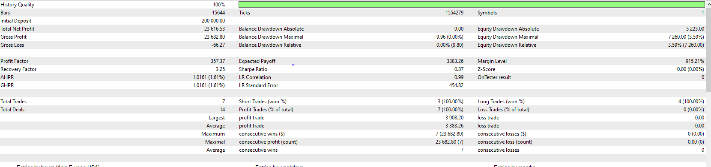
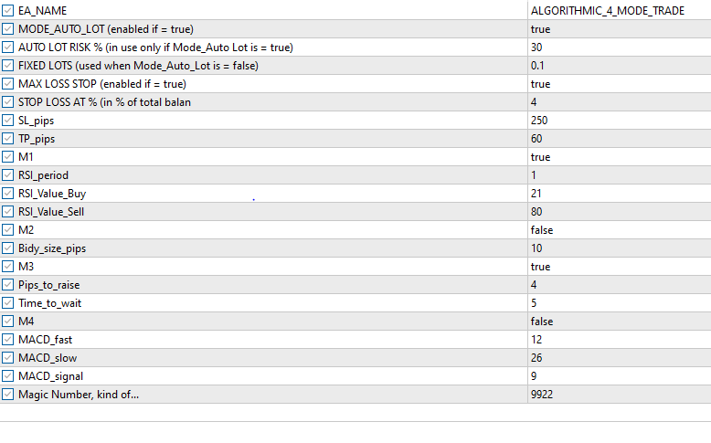
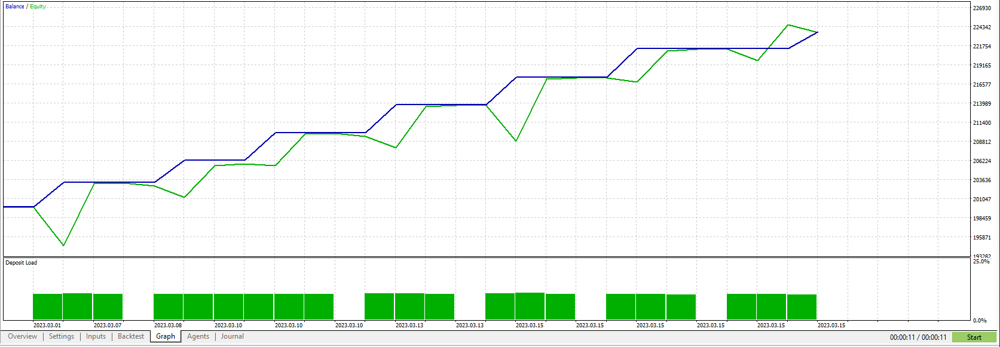
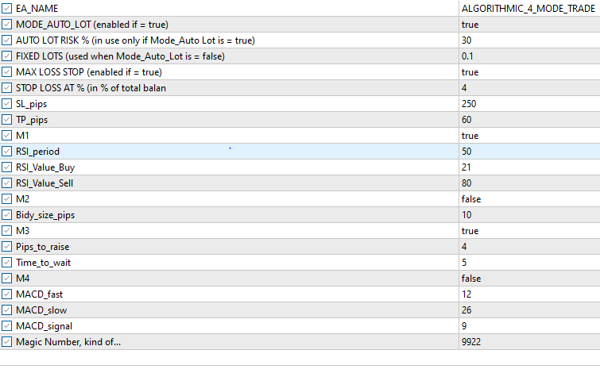
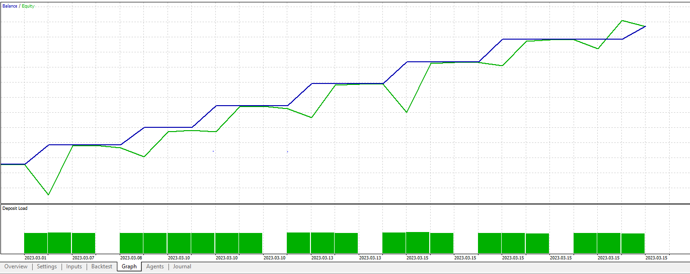
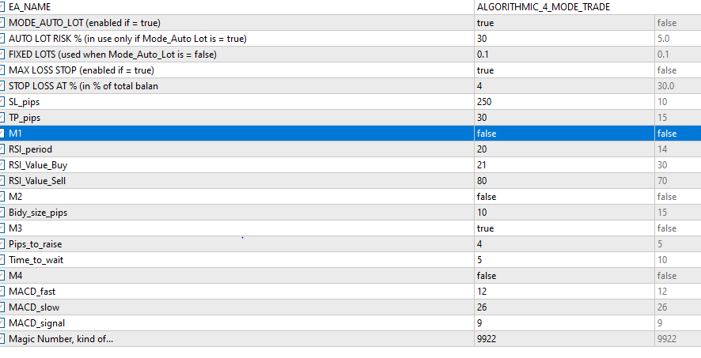
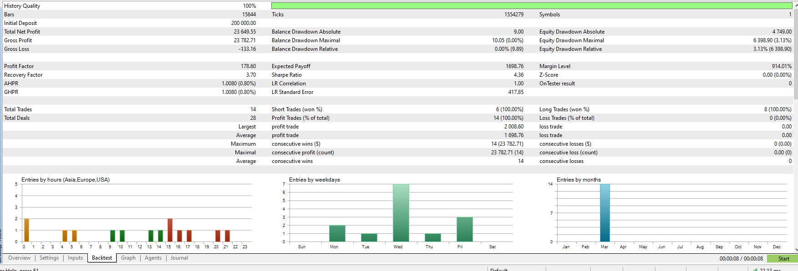
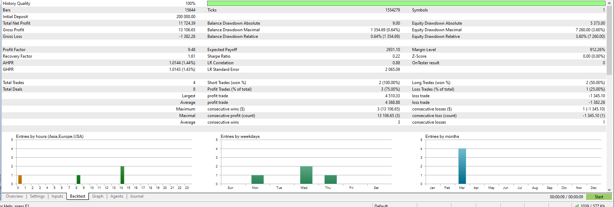
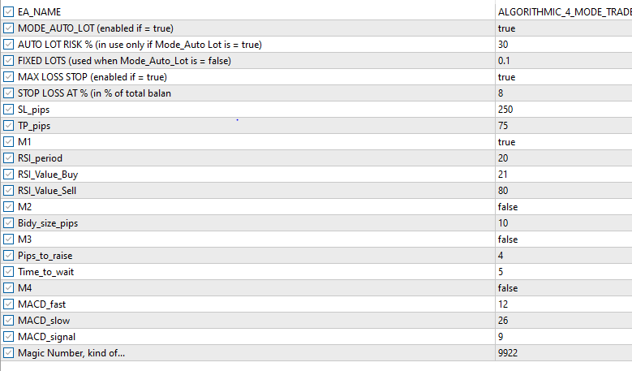
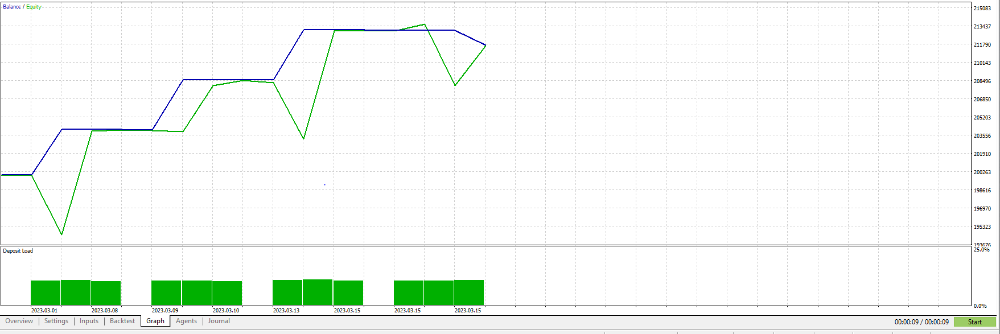

## M1 Tests with RSI_period 1 | 50

### RSI_period = 1

### RSI_period = 50

### M1 = False

### M1 = True only with RSI = 21

### Summary
TP and SL needs to be seperated by strategy as they behave differently

